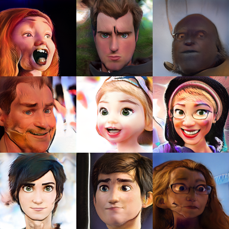
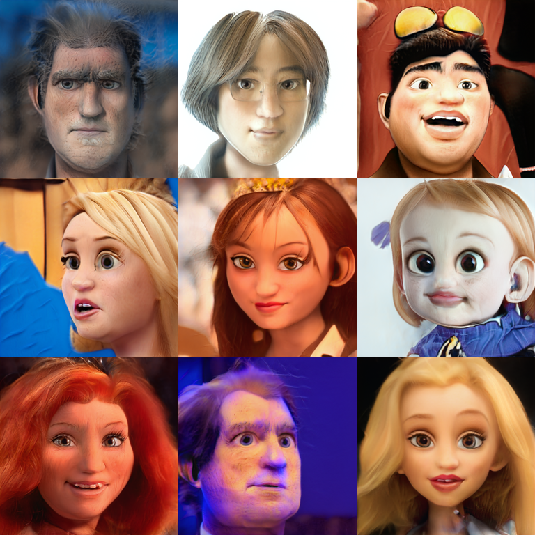

# StyleGAN2_model_samples
here are samples of models that I have
// TODO add authors and sources

## artoonsAligned_512

- [seed 1](content/CartoonsAligned_1_512/one_512_.png)

## artoonsAligned_36v2_1024

- [seed 1](content/CartoonsAligned_36v2_1024/one_1024_.png)

## CartoonsAligned_84v3_1024

- [seed 1](content/CartoonsAligned_84v3_1024/one_1024_.png)

## ChSt_1_1024

- [seed 1](content/ChSt_1_1024/one_1024_.png)

## FreaGAN_1024

- [seed 1](content/FreaGAN_1024/one_1024_.png)

## Muppets_1024

- [seed 1](content/Muppets_1024/one_1024_.png)

## WoW_Faces_1024

- [seed 1](content/WoW_Faces_1024/one_1024_.png)

## aBeauty_1024

- [seed 1](content/aBeauty_1024/one_1024_.png)

