# StyleGAN2_model_samples
here are samples of models that I have
// TODO add authors and sources

## ukiyoe_256

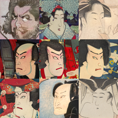
- [seed 1](content/ukiyoe_256/one_256_.png)

## panda_256

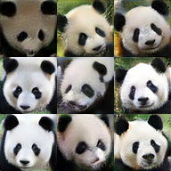
- [seed 1](content/panda_256/one_256_.png)

## ffhq_e_256

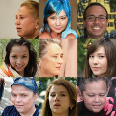
- [seed 1](content/ffhq_e_256/one_256_.png)

## cat_f_256

- [seed 1](content/cat_f_256/one_256_.png)

## fursona_512

- [seed 1](content/fursona_512/one_512_.png)

## anime_512

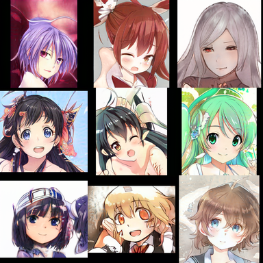
- [seed 1](content/anime_512/one_512_.png)

## artoonsAligned_512

- [seed 1](content/CartoonsAligned_1_512/one_512_.png)

## artoonsAligned_36v2_1024

- [seed 1](content/CartoonsAligned_36v2_1024/one_1024_.png)

## CartoonsAligned_84v3_1024

- [seed 1](content/CartoonsAligned_84v3_1024/one_1024_.png)

## ChSt_1_1024

- [seed 1](content/ChSt_1_1024/one_1024_.png)

## FreaGAN_1024

- [seed 1](content/FreaGAN_1024/one_1024_.png)

## Muppets_1024

- [seed 1](content/Muppets_1024/one_1024_.png)

## WoW_Faces_1024

- [seed 1](content/WoW_Faces_1024/one_1024_.png)

## aBeauty_1024

- [details](content/aBeauty_1024/README.md)

## asian_1024

- [seed 1](content/asian_1024/one_1024_.png)

## baby_1024

- [seed 1](content/baby_1024/one_1024_.png)

## baby_dolls_1024

- [seed 1](content/baby_dolls_1024/one_1024_.png)

## comics_monsters_1024

- [seed 1](content/comics_monsters_1024/one_1024_.png)

## ffhq_b_cartoon_64_1024

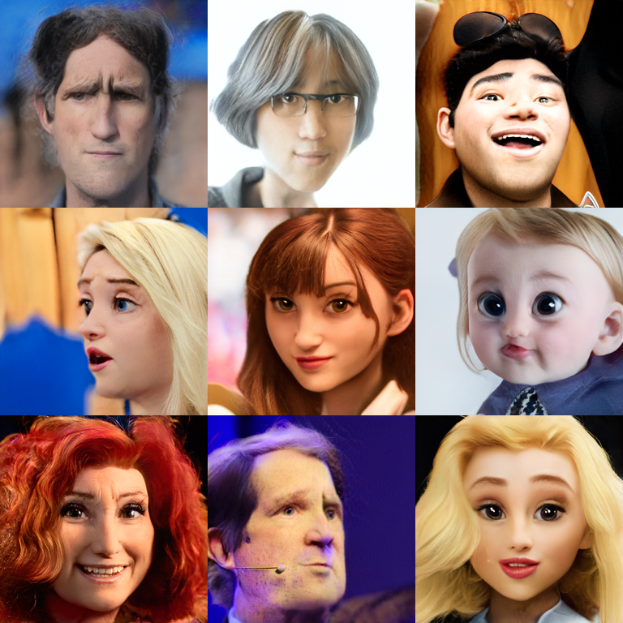
- [seed 1](content/ffhq_b_cartoon_64_1024/one_1024_.png)

## ffhq_e_104

- [seed 1](content/ffhq_e_104/one_1024_.png)

## ffhq_f_1024

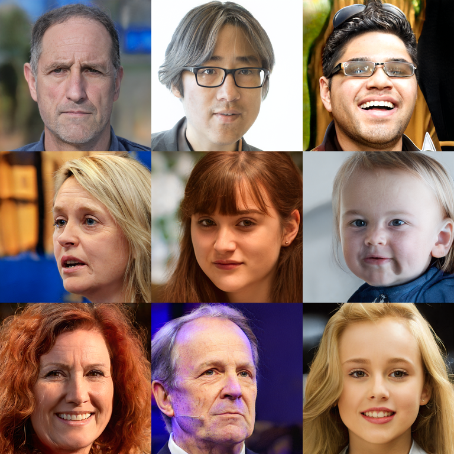
- [seed 1](content/ffhq_f_1024/one_1024_.png)

## metFaces_1024

- [seed 1](content/metFaces_1024/one_1024_.png)

## pokemon_1024

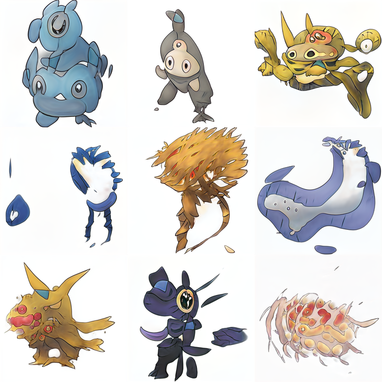
- [seed 1](content/pokemon_1024/one_1024_.png)

## ponies_1024

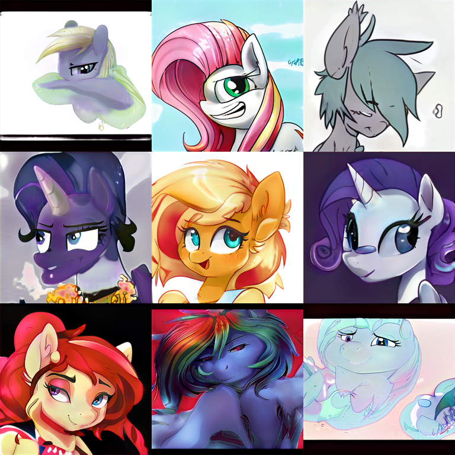
- [seed 1](content/ponies_1024/one_1024_.png)

## toony_b_paint_64_1024

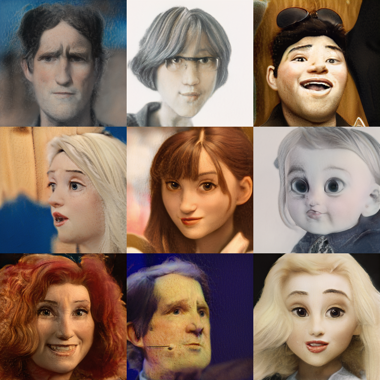
- [seed 1](content/toony_b_paint_64_1024/one_1024_.png)

## wiki_art_1_1024

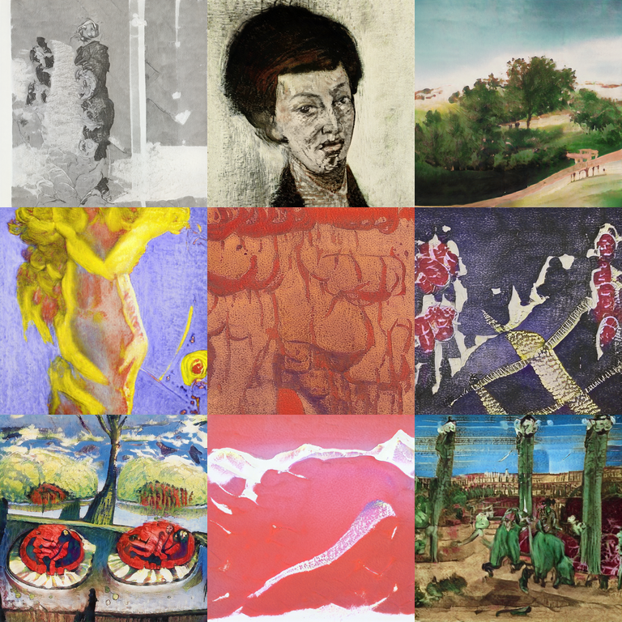
- [seed 1](content/wiki_art_1_1024/one_1024_.png)

## wiki_art_2_1024

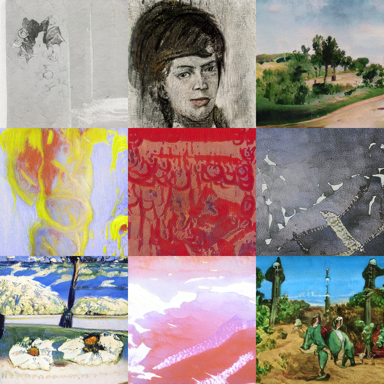
- [seed 1](content/wiki_art_2_1024/one_1024_.png)
